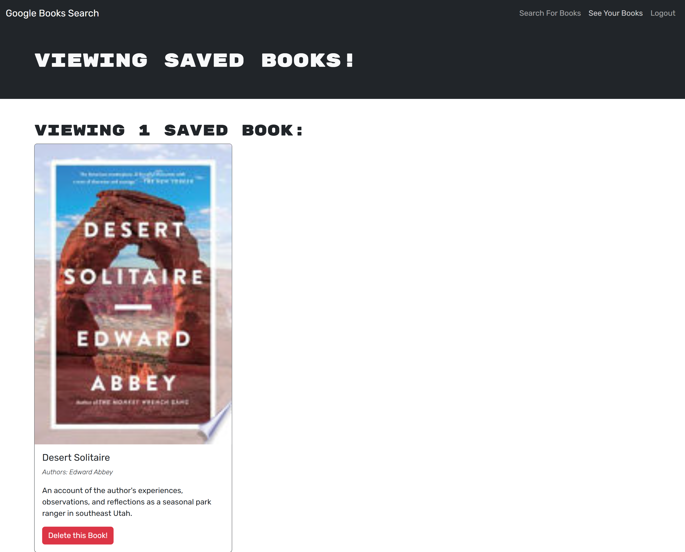

# orullian-react-portfolio-module-20-challenge

[Deployed Link](https://orullian-book-search-module-21-challenge.onrender.com/)

[Repo Link](https://github.com/JOrullian/orullian-book-search-module-21-challenge)

## Description

This book search engine is a full-stack application that allows readers to search for new books and create a personal list of books they want to purchase or save for future reference. Built using a GraphQL API, this app integrates with the Google Books API to retrieve book information and offers user account functionality to save and manage favorite books. Users can search for books, view book details, save selected books to their account, and remove them when desired.

This application has been refactored from a RESTful API to a GraphQL-based API to streamline data retrieval and improve flexibility on both the client and server sides.

## Features and Functionality

- Search for Books: Users can search for books by title, author, or keywords. Book search results display the title, author, description, image, and a link to the book on the Google Books website.

- User Authentication: Provides a secure login/signup functionality with authentication and authorization to enable personalized book saving.

- Login/Signup Modal: Accessible from the main menu, users can create an account or log in with existing credentials.

- Save Books: Logged-in users can save books from search results to their personal saved books list.
View Saved Books: Users can view their saved books with all relevant details, including title, author, description, and links.

- Remove Books: Allows users to remove books from their saved list when they no longer wish to keep them.

- Logout: Users can log out from the application, returning the interface to guest mode with basic search functionality.

## Usage

1. Initial Access:

When loading the app, users are presented with a search bar and options to either search for books 

or log in/sign up.

2. Book Search:

Without logging in, users can enter a search term and view the results. Each result includes the book title, author, description, an image, and a link to Google Books.

3. User Registration and Login:

Users can create an account by entering a username, email, and password or log in with their credentials. Upon successful login, additional features become available, including options to save 
books and view saved books.

4. Saving and Removing Books:

Logged-in users can save books from search results to their account. They can later view all saved books in their personal list and remove any books they no longer wish to keep.

5. Logging Out:

Users can log out, returning the app to the guest view with basic search functionality.

## Attribution

### Technologies Used

- Frontend:

    - React
    - Apollo Client (for GraphQL queries and mutations)
    - Bootstrap (for UI styling and components)

- Backend:

    - Node.js
    - Express.js
    - MongoDB (database)
    - Mongoose (for MongoDB object modeling)
    - Apollo Server (for GraphQL API)
    - JSON Web Token (JWT) for authentication

- APIs:

    - Google Books API (for book search and information retrieval)

Starter code has been provided by Southern Methodist University Coding Bootcamp.

The repo for the original code can be found here: [Original Code Repo](https://git.bootcampcontent.com/Southern-Methodist-University/SMU-VIRT-FSF-PT-05-2024-U-LOLC/-/tree/main/21-MERN/02-Challenge/Develop?ref_type=heads)

This project is part of an ongoing coding bootcamp